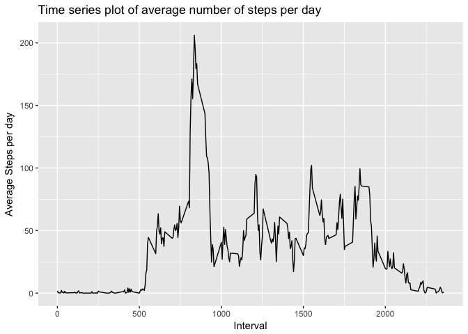
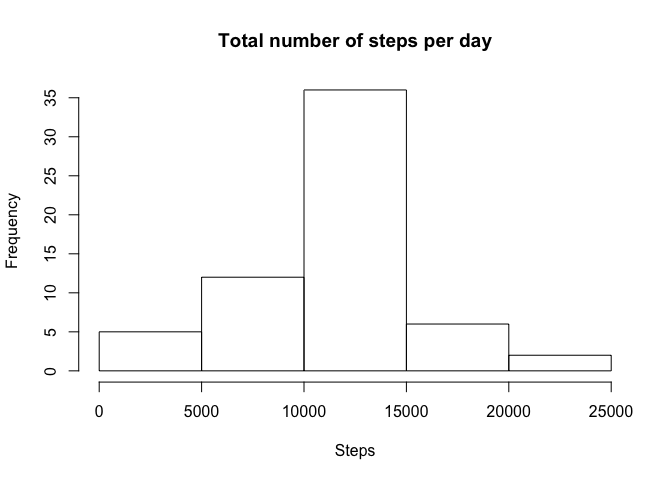
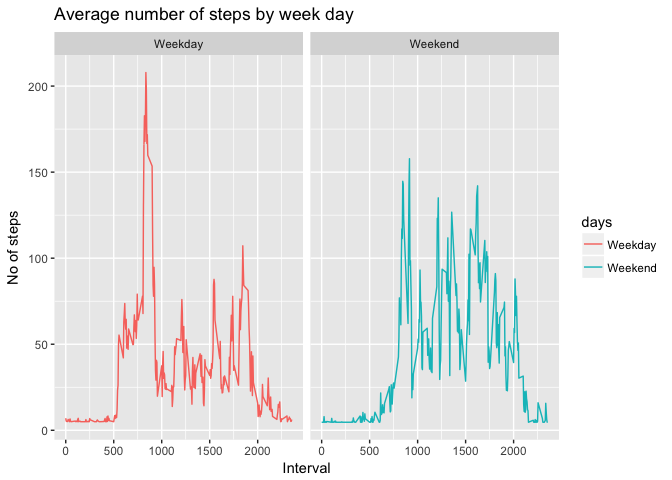

 
#COURSERA PROJECT ONE - REPRODUCIBE RESEARCH  
 

##LOADING AND PROCESSING DATA  

This assignment makes use of data from a personal activity monitoring device. This device collects data at 5 minute intervals through out the day. The data consists of two months of data from an anonymous individual collected during the months of October and November, 2012 and include the number of steps taken in 5 minute intervals each day.  

The data for this assignment can be downloaded from the course web site:  

Dataset: Activity monitoring data [52K]  
The variables included in this dataset are:  

steps: Number of steps taking in a 5-minute interval (missing values are coded as NA)  
date: The date on which the measurement was taken in YYYY-MM-DD format  
interval: Identifier for the 5-minute interval in which measurement was taken  
The dataset is stored in a comma-separated-value (CSV) file and there are a total of 17,568 observations in this dataset.  


```r
datafile<-"repdata%2Fdata%2Factivity.zip"  
outdir<-"."  
unzip(datafile,exdir=outdir)  
```

```
## Warning in unzip(datafile, exdir = outdir): error 1 in extracting from zip
## file
```

```r
data<-read.table("activity.csv",sep=",",header=TRUE)  
```

## WHAT IS THE MEAN TOTAL NUMBER OF STEPS TAKEN PER DAY ? 
1. Use lubridate package to convert date variable class to "Date"  
2. Use dplyr package to calculate sum of steps by date  
3. Plot histogram of number of steps per day  
4. calcualte medan and median number of steps per day


```r
library(lubridate)  
```

```
## 
## Attaching package: 'lubridate'
```

```
## The following object is masked from 'package:base':
## 
##     date
```

```r
data$date<-ymd(data$date)  
library(dplyr)  
```

```
## 
## Attaching package: 'dplyr'
```

```
## The following objects are masked from 'package:lubridate':
## 
##     intersect, setdiff, union
```

```
## The following objects are masked from 'package:stats':
## 
##     filter, lag
```

```
## The following objects are masked from 'package:base':
## 
##     intersect, setdiff, setequal, union
```

```r
d1<-aggregate(data$steps~data$date,FUN=sum)  
colnames(d1)<-c("Date","Steps")  
hist(d1$Steps,breaks=5,main="Total number of steps per day", xlab="Steps")  
```

<!-- -->

```r
MeanStepsDay<-round(mean(d1$Steps),0)  
MedianStepsDay<-round(median(d1$Steps),0) 
MeanStepsDay
```

```
## [1] 10766
```

```r
MedianStepsDay
```

```
## [1] 10765
```
##WHAT IS THE DAILY AVERAGE ACTIVITY PATTERN ?
1. calculate mean steps for every interval  
2. Use ggplot package to create a Time series plot of number of average number of steps per interval  


```r
d2<-aggregate(data$steps~data$interval,FUN=mean)
colnames(d2)<-c("Interval","Steps")
library(ggplot2)
g<-ggplot(d2,aes(Interval,Steps))
g+geom_line()+xlab("Interval")+ylab("Average Steps per day")+ggtitle("Time series plot of average number of steps per day")
```

<!-- -->

##CALCULATING MISSING VALUES AND IMPUTING TO COMPARE 
1. Finding total number of NA values  
2. Replace NA values with mean step values  
3. Plot histogram using newly created mean step values  
4. Calculate mean and median values from imputed data  


```r
sum(is.na(data))  
```

```
## [1] 2304
```

```r
data$steps[is.na(data$steps)]<-mean(data$steps, na.rm=TRUE)  
d1<-aggregate(data$steps~data$date,FUN=sum)  
colnames(d1)<-c("Date","Steps")  
hist(d1$Steps,breaks=5,main="Total number of steps per day", xlab="Steps")  
```

<!-- -->

```r
MeanStepsDay<-round(mean(d1$Steps),0)  
MedianStepsDay<-round(median(d1$Steps),0) 
MeanStepsDay
```

```
## [1] 10766
```

```r
MedianStepsDay
```

```
## [1] 10766
```
There is not much difference between original mean and imputed mean 

##ARE THERE DIFFERENCES BETWEEN WEEK DAY AND WEEK END  
1. Create weekday and week end classfication  
2. plot using ggplot  


```r
data$days<-weekdays(data$date)  
newdata<-data%>% mutate(days= ifelse(days=="Saturday" |days=="Sunday", "Weekend", "Weekday"))  
data1<-aggregate(steps~interval+days, newdata, mean)  
g<-ggplot(data1,aes(interval,steps,color=days))  
g+geom_line()+xlab("Interval")+ylab("No of steps")+ggtitle("Average number of steps by week day")+facet_grid(~days)  
```

<!-- -->


There is higher early peak during weekdays compared to week ends. Also overal increased activity during weekdays. 

            


